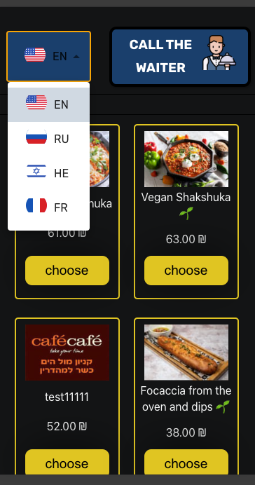

# Burger Bot Client React

## Description

This project is a React application for a Burger Bot. 

## Features

### Order Management:
-   customer orders
 
### Dish Management:
- Adding, editing, and removing dishes from the orders
 

### Extras and Toppings Management:
- Similar functionality to dish 
 
## Technical Features

- Frontend: React
 - Additional files: styles, configuration
- Repository: [GitHub Repository](https://github.com/yair-roshal/000-burger-bot-react)

## Note

This project is under development, and more features may be added in the future.

## Screenshots

- languages
  

 <br>
 
- order waiter
  

 <br>
 
- dev tools
  

 <br> 
 
- dish menu
  

 <br> 
 
- dish menu 2
  

 <br> 
 
- dishes
  

 <br> 
 
- order list
  

 <br> 
 
- order list 2
  

 <br>
 
## Getting Started

1. Clone the project:
```bash
   git clone https://github.com/yair-roshal/000-burger-bot-dashboard-react.git
```

2. Install dependencies:
```bash
npm install
   ```

3. Start the server:
```bash
npm start
   ```

Open a browser and navigate to http://localhost:3000.


## checking deploy ->
 
### `master`

[](https://app.netlify.com/sites/burger-web-app/deploys)

##  

### `dev`


[](https://app.netlify.com/sites/burger-web-app/deploys)
 